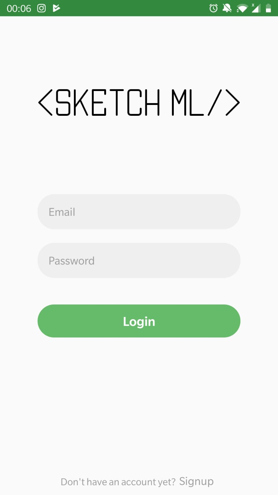

# SketchML
Final Year Project: 

Writing front-end code is time-consuming. The objective of this Project is to transform mobile hand-drawn wireframes from a picture into digital layouts and front-end code that can be used as a starting point for mobile applications development. SketchML is a solution developed using React Native and powered by an Artificial intelligence model that has been trained to recognise multiple user interface elements such as buttons, text box and images.

Users can create projects and upload images through the mobile application. A computer vision model predicts what UI elements are present in the image and their location. A layout algorithm uses the spatial information from all the bounding boxes of the predicted elements to generate a grid structure that accommodates all. All these pieces of information are used to generate React Native code reflecting the result.

[<!-- .element height="100px" width="100px" -->](https://www.youtube.com/watch?v=nqGolswHxSYk "Sketch ML")
